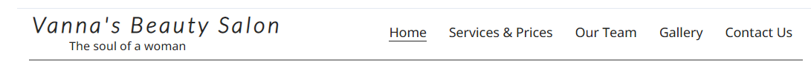
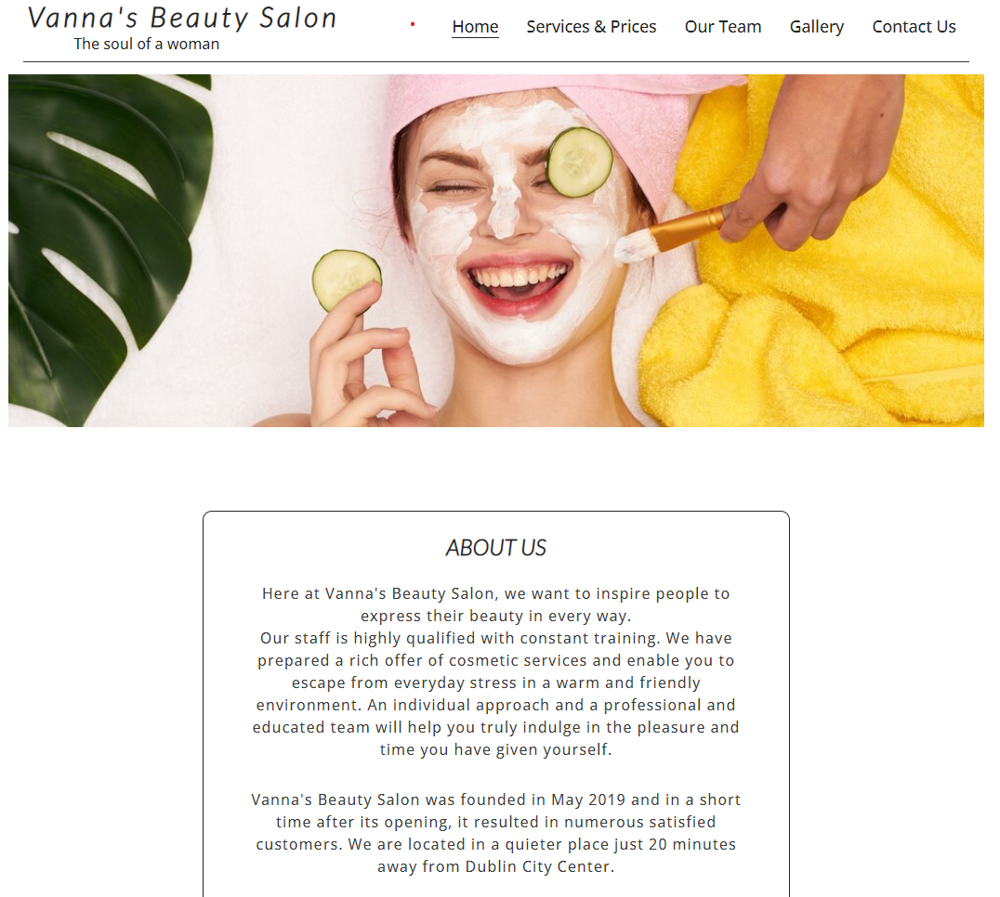
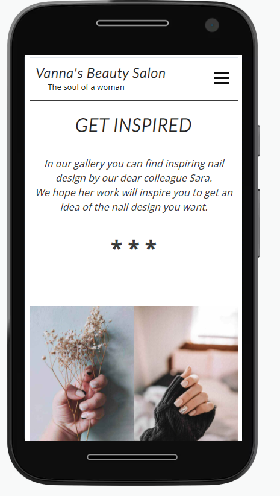

# Vanna's Beuty Salon

Vannas's Beauty Salon is a beauty salon that provides quality and professional services. The focus of this project is to bring their services closer to potential customers.
 Clients can enjoy the family atmosphere and professionalism while relaxing in the time they have decided to give themselves. 

You can view the deployed website [here](https://irissmok.github.io/Vannas-Beauty-Salon_MS1/)

#
# UX

The site is presented in a minimalist but effective way, providing all the information the user needs. In general, users can find out more about Vanna's Beauty Salon, his team, services and how to contact them, there is also a gallery wher users can find inspiration in nail design or view works before and after appropiate treatments.

## Users Stories 

- As a new user of this website, I want to easily find out the purpose of the site
- As a new user of this website, I want to quickly and easy find the services you provide
- As a new user of this website, I want to quickly and easyily find the price list of your services
- As a new user of this website, I want to see the experience of other client
- As a new user of this website, I want to see pictures of your work
- As a new user of this website, I want to easily found a way to contact you 
- As a new user to this website, I want to meet the team
- As a user, I want to follow the salon on social media so I can keep up to date with the latest information

#
# Scope 

## Features

- An easy and simple navigation throught the website
- List of services and their prices
- Easily visible testimonials of other clients
- A galery with inspiring nail design 
- Contact form so that clients can easily get in touch with the salon
- Easily visible salon contact infromation
- Social links in the footer of each page so user can follow the salon via social networks and be up to date with the latest information

### Future Features

- Online booking so that the client can quickly select the desired date from the calendar 

#
# Structure

- **Header**  
    - Salon logo positioned left, navigation bar on the right
    - Appears on every page

- **Nav bar**
    - Appers on every page so users can esily navigate throught the site

- **Footer**
    - Appears on every page with a contact information and social links

 - **Home Page**
    - *Hero image* - appears at the top of the home page, located below the header section, contains striking colors that elevate the look of the page
    - *About Us* - located below the Hero image, allows users to get more informations about the salon
    - *Testimonials* - just below the "About Us" section, grouped horizontally, next to each other, for screens smaller than 1200px they are grouped vertically. Allow potential client to see the reviews from current/previous clients, which will help them trust the services offered by the salon
    - *Contact Us* - provides information about salon opening hours, phone number, email address and a link that leads the user to "Contact Us" page where the user can fill out a form to get in touch with a beautician and get an answer to any questions they may have
    
-  **Services & Prices** - allows the user to find out the services and their prices offered by the salon

- **Our Team** - allows the user to get to know the salon team

- **Gallery** - allows the user to see images of the the nail design and perhaps get inspired. 

- **Contact Us** - allows the user to contact the salon by form 

# Wireframes

### _Home Page_ 

### _Services & Prices_

### _OurTeam_

### _Gallery_

### _Contact Us_

### _Mobile View - Home Page_

### _Mobile View - Our Team_

### _Mobile View - Gallery_

### _Mobile View - Contact Us_

# Surface

## Design 
As the salon itself exudes calm and relaxation, I created the page in such a tone. The main background is white because it indicates a sterile, clean and bright space. Background colors I used are bright and soothing, and the images are bright and colorful. The goal was to bring the user closer to the atmosphere of the salon.

## Chosens Color 

- **#3a3a3a the main color** - I chose this color from the lesson "Love Running". I really liked how the text color looked on the page and I used it too
- **#2a2a2a for all h2 headings and nav bar** - color from "Love Running" lesson, I liked how it looks on text. It's neiyher too dark nor too bright
- **rgba(237, 243, 210, 0.6)** - background for Address and Opening Hours. 
It blends perfectly with the look of the whole page and the background image. I wanted the color to match both the image of the head, in which yellow predominates, as well as the background image.
- **rgb(157 157 45 / 43%)** - background for Address and Opening Hours, for media query (max-width 550px) - the background image disappears below 550px, so the background color itself is too pale without the image. I changed the color which gives a nice look to the other half of the pages, and fits nicely with the hero image
- **rgba(79, 79, 82, 0.6)** - for the Footer background. I liked the color because it is neither too dark nor too bright. It does not spoil the look of the page. Since the footer will be on every page, I wanted to choose a color that blends nicely with all the colors
- **rgba(154, 175, 185, 0.7)** - for the "Price List" background color. Blends nicely with the background image. The color is not intrusive, it is soothing like the whole page
- **rgba(79, 79, 82)** - for the Submit button. Fits nicely with the footer. Color is not too pale or too dark yet it's noticeable
 

## Font 

- Open Sans, sans-serif - main font
- Lato - for all h2 and h3 headings

## Media

**Hero image** - is designed in bright and strong colors to grab the user's attention and elevate the overall look of the page

**Contact section** - contains a background image that is soothing and mild. Not conspicuous, and yet does not make the page monotonous

**Services & Prices** - contains a background image that is mild and relaxing

**Our Team** - contains an image just below the header. The photo shows a beautician doing a manicure for a customer. I chose this image because it shows a beautician in her work environment and blends nicely with the whole look of the page.

**Gallery** - contains nail design images so that the user can find the desired design if he needs inspiration. The gallery also helps promote the salon

**Contact Us** - contains images just below the header. Images are placed horizontally. After 950 px they no longer appear on the page.

# Technologies Used

## Languages 

- [HTML5](https://en.wikipedia.org/wiki/HTML5)
- [CSS3](https://en.wikipedia.org/wiki/CSS)

## Frameworks, Libraries & Programs Used

- [Google Fonts](https://fonts.google.com/https://fonts.google.com/) - provide all of the fonts for this website.

- [Font Awesome](https://fontawesome.com/) -was used for the site icos.

- [Java srcipt](https://en.wikipedia.org/wiki/JavaScript) - used for the hamburger navigation and icons
- [Github](https://github.com/IrisSmok) - was used to store the project code.

- [Gitpod](https://www.gitpod.io/) - was used for coding.

- [Balsamiq](https://balsamiq.com/) - was used to create site wireframes.

- [Shutterstock](https://www.shutterstock.com/home) and [Unsplash photo](https://unsplash.com/) - was used to for all images on the website.

- [Google map generator](https://google-map-generator.com/) - was used to import business location.

- [jQuery](https://jquery.com/) - was used for a responsive navbar.

- [Am I Responsive](http://ami.responsivedesign.is/) - to check if the site is responsive on different screen sizes.

- [IMG2GO](https://www.img2go.com/compress-image#j=f26cc008-23b4-4d4e-9934-96877fa9a7e7) and [Tiny PNG](https://tinypng.com/) - these sites were used to help me compress the images

- [Free Online HTML Formatter](https://www.freeformatter.com/html-formatter.html) - was used to correct indentation issues and get rid of too much whitespace

# Testing
- Tested on Chrome, Opera, Microsoft Edge and Firefox desktop version browsers
- Chrome Developer Tools are used to test the responsiveness on: Desktop, Laptop, Moto G4, Galaxy S5, iPhone 5/SE, iPhone 6,7,8, iPhone 6,7,8 Plus, iPad, iPad Pro, Galaxy Fold

# Validating 
The W3C Markup Validator and W3C CSS Validator Services were used to check my code for syntax errors in this project.

- [HTML](https://validator.w3.org/#validate_by_input)- I checked each page by direct input method on HTML validator site

- [CSS](https://jigsaw.w3.org/css-validator/)

- I used Lighthouse tools to test my website

## User Story Testing

### **Testing Users Stories form (UX) Section**

1.  As a new user of this website, I want to know the purpose of the site and how to easily navigate through the website
    -  navigation is located on each page so that the user can easily and simply navigate through the page and find all the necessary information

 *Desktop,Laptop View*

        

 *Tablet View* 

 *Phone View*

2. As a new user of this website, I want to find the services you provide, quickly and easily

    - the user can easily find a price list that is readable and clear

3. As a new user of this website, I want to see the experience of other clients

    - testimonials are placed on the first page so that they are easily noticeable

4. As a new user of this website, I want to see pictures of your work

    - the gallery provides the user with an insight into the quality and inspiring work of the salon

  

5. As a new user of this website, I want to easily find a way to contact you 
    - the user can find the contact information on the Home page under the "Contact" section. But it can also open the "Contact Us" page where there is a contact form where each user can fill out a form and send an inquiry to a beautician

6. As a new user of this website, I want to meet the team
    - the user can meet our team on the "Meet our team" page. Where he can get more information about the staff and their education

7. As a user, I want to follow the salon on social media so I can keep up to date with the latest information

    - on each page, there is a footer with social links. At any time, the user can click on the icon that takes him to the social media site of the salon where he can follow the latest information at any time

## Bugs and Issues

- I tested a page on my phone, the Samsung Galaxy S20 FE, with a black theme. When I open the page, I don’t see hamburger menu. The rest of the text of the page changes color to white, but the hamburger menu does not change its dark color and is therefore not noticeable, but it is still functional.

- Design improvment- On the page "Services & Prices" I would like to improve the price list design. When the screen reaches a certen size ( Mobile view), the prices of the treatments should be closer to bottom border. 
I hope to solve this problem in the future.

- For the Gallery Lighthouse report, I noticed that the report varies if I re-report the page. Lighthouse would jump from 85 to 93.

### **HTML Validator** 

- *Warning* : Element “p” not allowed as child of element “h1” in this context
 
warning was fixed by removing th "p" element as a child of "h1" element. I created a "ul" and nested "h1" element and "p" element inside the "li" element. 

 - *Warning* : Element “br” not allowed as child of element “ul” in this context.

warnign was fixed by removing the "br" as a child of "ul" element. 

### **CSS Validator** 

- *Value Error* : font-weight 600px is not a font-weight value : 600px

Error was fixed by removing the incorrect font-sweight

- *Warning* :  Inner is not a color value : inner 0 0 4px rgb(0, 0, 0, 0.2)

warning was fixed by removing the incorrect color value

- *Warning* : Family names containing whitespace should be quoted. If quoting is omitted, any whitespace characters before and after the name are ignored and any sequence of whitespace characters inside the name is converted to a single space.

warning was fixed by removing the white space between the family names.

- *Warning* : -webkit-transition is a vendor extension

warning was fixed by removing the incorrect CSS rule

- *Warning* -moz-border-radius is a vendor extension
     warning was fixed by removing the incorrect CSS rule 

# Final Product 

## Desktop View 
 
 ### _Home Page_

 ### _Services & Prices_

### _Our Team_

### _Gallery_

### _Contact Us_

## Tablet View 
 
 ### _Home Page_

 ### _Services & Prices_

### _Our Team_

### _Gallery_

### _Contact Us_

## Mobile View 
 
 ### _Home Page_

 ### _Services & Prices_

### _Our Team_

### _Gallery_

### _Contact Us_

# Deployment

## GitHub Pages
1. Log into GitHub and locate the repository.
2. At the top locate the settings option 
3. Scroll towards  the bottom of the page and locate GitHub Pages 
4. Click on the link "Check it out here!"
4. Under 'Source' dropdown, click 'Master' from the options.
5. Click the save button.
6. The site is now published, it may not be available immediately. 
7. The site URL is visible on the green bar under the "Github Pages".

## Github Clone 

1. First you need to install the GitPod Browser Extension.
2. Log into GitHub and locate the repository.
3. Click the green "Gitpod" button just below the Settings.
4. Now you created a new Gitpod workspace from the code in Github

# Credits

## Content

- All content was written by Iris Smok
- The structure of the gallery page is similar to the "Love Running" gallery page. I customized the design to fit my website.

- [Responsive navbar and hamburger menu](https://dev.to/devggaurav/let-s-build-a-responsive-navbar-and-hamburger-menu-using-html-css-and-javascript-4gci) - this site is used to help me build a responsive navbar and hamburger menu

## Media

- All images were taken from  [Shutterstock](https://www.shutterstock.com/home) and [Unsplash photo](https://unsplash.com/) 

## Acknowledgements

- Thanks to my mentor for helpful feedback
- Slack community for answering all my questions 
- Big thanks to my husband Mislav for helping me test the website

